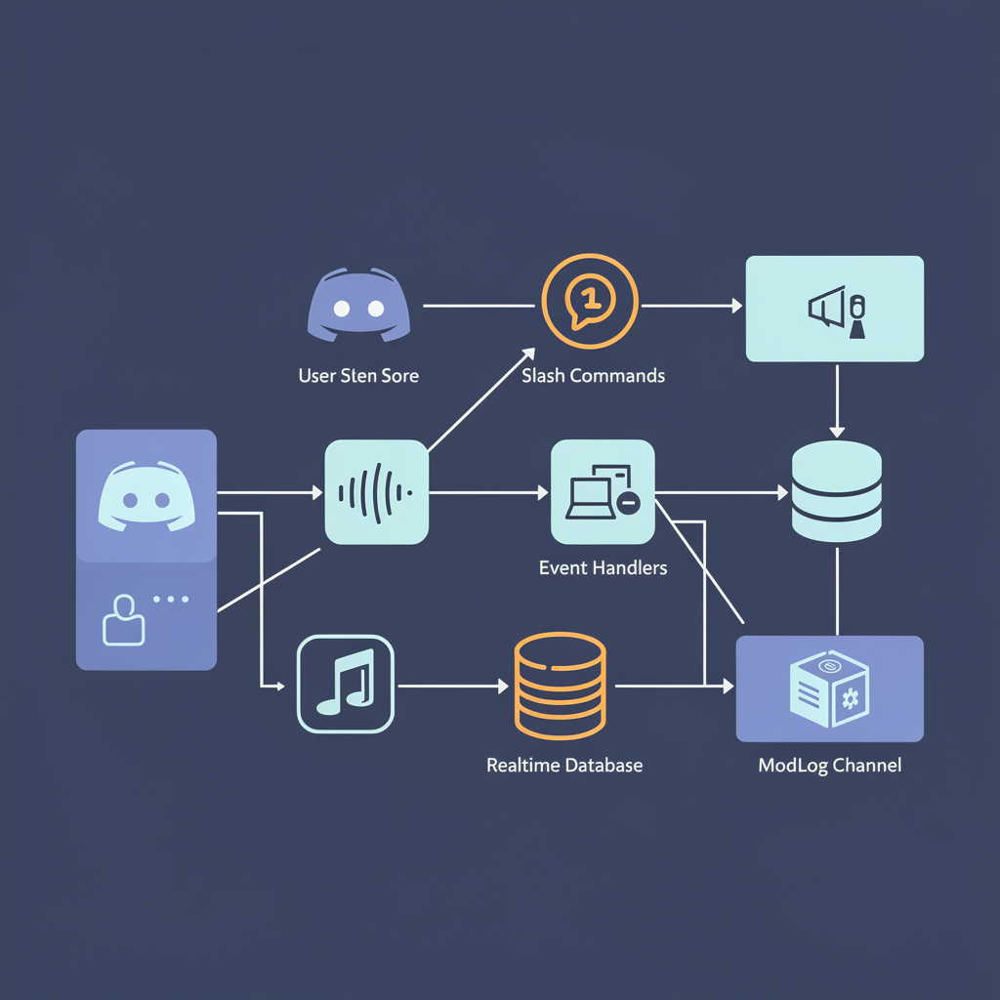

# Jubbio Project - Moderasyon + Ekonomi Botu


Bu proje, `@jubbio/core` uzerinde calisan, slash-komut odakli bir Jubbio botudur.
Ana odaklar:
- Moderasyon otomasyonu
- Sunucu sistem yonetimi (modlog, giris/cikis, otorol)
- Ekonomi sistemi (cuzdan, banka, market, envanter, liderlik)
- Eglence komutlari (anket, zar, yazi-tura, fal, espri)



## Icerik
1. Proje Ozet
2. Ozellikler
3. Teknoloji ve Mimari
4. Klasor Yapisi
5. Gereksinimler
6. Kurulum
7. Ortam Degiskenleri
8. Calistirma
9. Komut Senkronizasyonu
10. Komut Rehberi
11. Ornek Kullanim Akislari
12. Veri Yapisi
13. Sorun Giderme
14. Bilinen Sorunlar ve Teknik Notlar
15. Guvenlik Notlari
16. Gelistirme Onerileri

## Proje Ozet
Bot, event tabanli calisir:
- `app.js` tum komutlari ve event dosyalarini yukler.
- `ready` eventi bot acilisinda slash komutlari Jubbio API'ye senkronlar.
- `interactionCreate` slash komutlari, yardim secim menusu ve anket butonlarini yonetir.
- Moderasyon/sistem event'leri (uye giris-cikis, ban, mesaj silme/duzenleme) modlog entegrasyonu ile kayit alir.
- Ekonomi verileri Firebase Realtime Database'e yazilir.

## Ozellikler
- Slash komut tabanli kullanim
- Kategori secmeli yardim menusu (`/yardim`)
- Modlog kanali yonetimi (`/modlog`)
- Giris/cikis mesaj sistemi (`/giris`, `/cikis`)
- Otorol sistemi (`/otorol`)
- Moderasyon komutlari (`/ban`, `/kick`, `/timeout`, `/untimeout`, `/sil`)
- Ekonomi sistemi:
  - Cuzdan/banka
  - Gunluk odul ve is komutlari
  - Riskli gelir mekanikleri (`/suc`, `/soygun`)
  - Market, urun satin alma, envanter ve urun kullanma
  - Liderlik tablosu ve profil karti
- Eglence komutlari (`/anket`, `/zar`, `/yazitura`, `/fal`, `/espri`)


## Teknoloji ve Mimari
- Runtime: Node.js (CommonJS)
- Ana kutuphaneler:
  - `@jubbio/core`
  - `firebase-admin`
- Veritabani: Firebase Realtime Database
- Komut ve event yukleme: Dinamik (`src/commands`, `src/events` klasorleri)

Calisma akisi:
1. Bot baslatilir.
2. Komut dosyalari okunur ve payload olarak toplanir.
3. Event dosyalari dinlenmeye alinir.
4. `ready` ile komutlar guild veya global scope'ta senkronlanir.
5. Kullanici interaction/message event'leri ile komutlar calisir.

## Klasor Yapisi
```text
.
|-- app.js
|-- package.json
|-- .env.example
|-- data/
|   `-- database.json
|-- docs/
|   `-- images/
|       |-- readme-hero.png
|       |-- readme-architecture.png
|       `-- readme-features.png
`-- src/
    |-- config.js
    |-- commands/
    |-- events/
    `-- utils/
```

## Gereksinimler
- Node.js 18+
- Jubbio bot token
- Firebase service account JSON
- Firebase Realtime Database URL

Opsiyonel (AI modulu kullanilacaksa):
- OpenAI-compatible API key (`API_KEY`)
- Base URL (`API_URL`)

## Kurulum
1. Bagimliliklari kur:
```bash
npm install
```

2. Ortam dosyasini olustur:
```bash
copy .env.example .env
```
PowerShell kullaniyorsan:
```powershell
Copy-Item .env.example .env
```

3. `.env` icini doldur:
```env
BOT_TOKEN=jubbio_bot_token
DEV_GUILD_ID=opsiyonel_test_sunucusu
API_KEY=opsiyonel_ai_key
API_URL=opsiyonel_openai_compatible_url
```

4. Firebase service account dosyasini yerlestir:
- Yol: `src/serviceAccount.json`
- Bu dosya repoya commit edilmemeli.

5. `src/config.js` icinde Firebase ayarlarini proje bilgine gore guncelle:
- `databaseURL`
- `appName`

## Ortam Degiskenleri
| Degisken | Zorunlu | Aciklama |
|---|---|---|
| `BOT_TOKEN` | Evet | Jubbio bot token |
| `DEV_GUILD_ID` | Hayir | Komutlari test guild'ine hizli senkronlamak icin |
| `GUILD_ID` | Hayir | `DEV_GUILD_ID` yoksa alternatif guild hedefi |
| `COMMAND_GUILD_ID` | Hayir | `DEV_GUILD_ID` yoksa alternatif guild hedefi |
| `API_KEY` | Hayir | AI modulu icin API key |
| `API_URL` | Hayir | AI modulu icin base URL |

Not: Guild ID degiskenleri yoksa komutlar global scope'a senkronlanir.

## Calistirma
Bu repoda `start` script'i tanimli degil. Dogrudan su komutu kullan:
```bash
node app.js
```

Bot basarili acilista konsolda login ve komut sync bilgisi gorursun.

## Komut Senkronizasyonu
`src/events/ready.js` davranisi:
- `DEV_GUILD_ID` (veya `GUILD_ID` / `COMMAND_GUILD_ID`) varsa guild-level sync yapar.
- Hicbiri yoksa global sync yapar.

Guild sync test asamasinda daha hizlidir. Global sync birkac dakika surebilir.

## Komut Rehberi

### Sistem
| Komut | Aciklama | Yetki |
|---|---|---|
| `/yardim` | Kategori secmeli yardim menusu | - |
| `/modlog islem:<set/clear> kanal:<kanal>` | Modlog kanalini ac/kapat | `ManageGuild` |
| `/giris islem:<set_channel/set_message/disable>` | Giris kanali veya sablon mesaji ayarla | `ManageGuild` |
| `/cikis islem:<set_channel/set_message/disable>` | Cikis kanali veya sablon mesaji ayarla | `ManageGuild` |
| `/otorol islem:<set/clear> rol:<rol>` | Yeni uye icin otomatik rol | `ManageRoles` |

### Moderasyon
| Komut | Aciklama | Yetki |
|---|---|---|
| `/ban kullanici:<uye> sebep:<metin> mesaj_gun:<0-7>` | Uye banlar | `BanMembers` |
| `/kick kullanici:<uye> sebep:<metin>` | Uye atar | `KickMembers` |
| `/timeout kullanici:<uye> sure_dk:<1-10080> sebep:<metin>` | Gecici susturma | `ModerateMembers` |
| `/untimeout kullanici:<uye> sebep:<metin>` | Susturmayi kaldirir | `ModerateMembers` |
| `/sil miktar:<1-100>` | Toplu mesaj temizler | `ManageMessages` |

### Ekonomi
| Komut | Aciklama |
|---|---|
| `/bakiye [kullanici]` | Cuzdan, banka, toplam deger |
| `/profil [kullanici]` | Gelismis ekonomi profil karti |
| `/gunluk` | Gunluk odul (24 saat cooldown) |
| `/calis` | Is komutu (45 dk cooldown) |
| `/suc` | Riskli kazanc denemesi (1 saat cooldown) |
| `/soygun kullanici:<uye>` | Diger oyuncuyu soyma denemesi (2 saat cooldown, lockpick gerekir) |
| `/yatir miktar:<deger/hepsi>` | Cuzdandan bankaya para aktarir |
| `/cek miktar:<deger/hepsi>` | Bankadan cuzdana para ceker |
| `/odeme kullanici:<uye> miktar:<deger>` | Kullaniciya transfer (%3 vergi) |
| `/market` | Market urunlerini listeler |
| `/satinal urun:<id> [adet]` | Marketten urun alir |
| `/envanter [kullanici]` | Envanteri goruntuler |
| `/kullan urun:lucky_charm` | Kullanilabilir urunleri aktif eder |
| `/liderlik [limit]` | Sunucu liderlik tablosu |

Market urunleri (koddaki varsayilan):
- `lockpick`
- `shield`
- `lucky_charm`
- `vault_upgrade`

### Eglence
| Komut | Aciklama |
|---|---|
| `/anket soru:<metin>` | Butonlu canli anket |
| `/zar [yuz]` | Zar atar |
| `/yazitura` | Yazi/tura |
| `/fal soru:<metin>` | 8ball tarzi cevap |
| `/espri` | Rastgele espri |

## Ornek Kullanim Akislari

### 1) Sunucu ilk kurulum
1. `/modlog islem:set kanal:#modlog`
2. `/giris islem:set_channel kanal:#hosgeldin`
3. `/cikis islem:set_channel kanal:#cikis`
4. `/otorol islem:set rol:@Uye`
5. `/yardim` ile kategorileri kontrol et

### 2) Ekonomi baslangic
1. `/gunluk`
2. `/calis`
3. `/market`
4. `/satinal urun:lockpick adet:1`
5. `/envanter`
6. `/kullan urun:lucky_charm`

### 3) Moderasyon operasyonu
1. `/sil miktar:20`
2. Gerekirse `/timeout` veya `/kick`
3. Olay kayitlarini modlog kanalindan izle

## Veri Yapisi
Firebase'de temel yollar:
- `guilds/<guildId>/bot_settings`
- `guilds/<guildId>/economy/users/<userId>`
- `guilds/<guildId>/chat_history/<channelId>` (AI chat akisinda)
- `users/<userId>/memory/*` (AI memory)

Ekonomi account varsayilan alanlari:
- `wallet`, `bank`, `xp`, `level`
- `vaultLevel`, `inventory`
- `cooldowns` (`daily`, `work`, `crime`, `rob`)
- `streaks`, `boosts`, `stats`

## Sorun Giderme

### BOT_TOKEN hatasi
Belirti:
- `BOT_TOKEN environment variable is required.`

Cozum:
- `.env` dosyasinda `BOT_TOKEN` tanimli oldugunu kontrol et.

### Komutlar gorunmuyor
Kontrol listesi:
1. Bot online mi?
2. `ready` event log'unda sync sonucu var mi?
3. Guild sync mi global sync mi kullaniyorsun?
4. Botun `applications.commands` yetkisi var mi?

### Firebase baglanti sorunu
Kontrol listesi:
1. `src/serviceAccount.json` dosyasi mevcut mu?
2. `src/config.js` icindeki `databaseURL` dogru mu?
3. Service account'a Realtime Database yetkisi verildi mi?

## Bilinen Sorunlar ve Teknik Notlar
Bu bolum, repodaki mevcut duruma gore yazilmistir:
- `src/events/chat.js` dosyasi `../utils/ai_handler` import ediyor, ancak repoda `src/utils/ai_handlers.js` var.
- `src/utils/knowledge_base.js` icinde de benzer `ai_handler` importu var.
- AI yardimci dosyalari icin gereken `openai`, `dotenv`, `axios` bagimliliklari `package.json` icinde tanimli degil.
- `src/utils/logger.js` dosyasinda hardcoded webhook URL bulunuyor (guvenlik riski).
- Bircok komutta `getUser(...)` sonucu dogrudan user ID gibi kullaniliyor; bu durum bazi aksiyonlarda tip uyumsuzluguna yol acabilir.

Bu maddeler duzeltilmeden AI/advanced logger akislarinda runtime hata alinabilir.

## Guvenlik Notlari
- `.env` ve `src/serviceAccount.json` dosyalarini repoya commit etme.
- Token ve webhook bilgilerini ortam degiskenlerinden yonet.
- Production'da bot izinlerini minimum gerekli yetkilerle sinirla.

## Gelistirme Onerileri
1. `package.json` icine `start` ve `dev` script'leri ekle.
2. AI modulu import isimlerini tutarli hale getir.
3. Hardcoded webhook yerine env tabanli konfigurasyon kullan.
4. Komutlar icin unit/integration test altyapisi ekle.
5. CI pipeline ile lint + smoke test calistir.

---
README, projenin 3 Mart 2026 tarihindeki mevcut kod durumuna gore hazirlandi.

